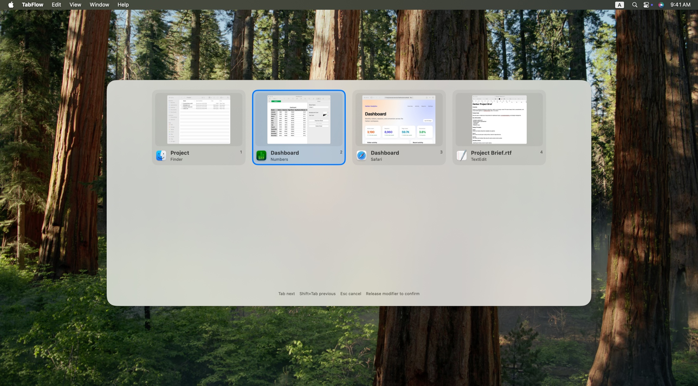
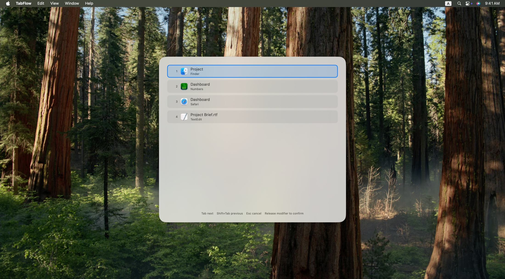
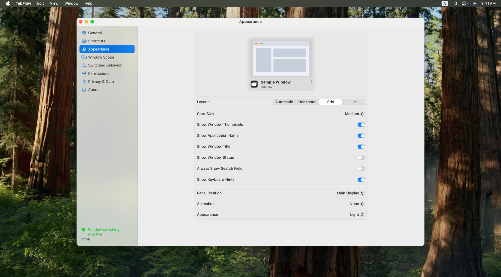

<p align="center">
  English ·
  <a href="README.zh-Hans.md">简体中文</a>
</p>

<h1 align="center">TabFlow</h1>

<p align="center">
  Switch windows, not just apps.
</p>

<p align="center">
  <a href="https://github.com/Dreace/TabFlow/releases/latest"></a>
  
  
  <a href="LICENSE"></a>
</p>

<p align="center">
  
</p>

macOS Command-Tab switches by application. Multiple windows in one app still need a second search.

TabFlow switches by window. Press **⌥ Tab**, select a window, then release ⌥ to switch.

## Install

Download the latest DMG from [Releases](https://github.com/Dreace/TabFlow/releases/latest). Open it and drag **TabFlow** into Applications.

Grant the requested permissions on first launch.

## Features

* Switch by window, including multiple windows from the same app
* Default shortcut **⌥ Tab**, customizable
* Minimized windows, multiple displays, and Spaces
* Optional window thumbnails
* Automatic, horizontal, grid, and list layouts
* Custom window scope, sort order, and grouping
* Menu bar app, with optional launch at login

## Gallery

### List layout

<p align="center">
  
</p>

### Appearance settings

<p align="center">
  
</p>

## Usage

Hold **⌥** and press **Tab** to open the switcher. Keep pressing Tab to select a window, then release ⌥ to switch.

| Key | Action |
| --- | --- |
| ⌥ Tab | Open the switcher / next window |
| ⇧⌥ Tab | Previous window |
| ← → ↑ ↓ | Move selection |
| Return | Switch immediately |
| Esc | Cancel |

The shortcut can be changed in **Settings → Shortcuts**.

## Permissions

TabFlow uses these system permissions:

| Permission | Required | Used for |
| --- | --- | --- |
| Accessibility | Yes | Reading window information, restoring minimized windows, and switching |
| Input Monitoring | Yes | The global shortcut |
| Screen Recording | No | Window thumbnails |

Window information and thumbnails stay on the Mac.

## Requirements

* macOS 15.7 or later

## Build

Clone the repository:

```bash
git clone https://github.com/Dreace/TabFlow.git
cd TabFlow
```

Open the project in Xcode and run it:

```bash
open TabFlow.xcodeproj
```

Or build from the command line:

```bash
xcodebuild \
  -project TabFlow.xcodeproj \
  -scheme tabflow \
  -configuration Debug \
  build
```

The development build still needs Accessibility and Input Monitoring on first launch.

## FAQ

### Can it switch browser tabs?

No. TabFlow switches macOS windows, not browser tabs.

### Does it support multiple displays?

Yes. TabFlow can switch to windows on other displays.

### Why are there no window thumbnails?

Thumbnails need Screen Recording. Without it, switching still works with app icons and window titles.

### Does TabFlow replace Mission Control or window tiling?

No. TabFlow only switches existing windows. It does not resize or arrange them.

## License

TabFlow is available under the [GPL-3.0 license](LICENSE).
