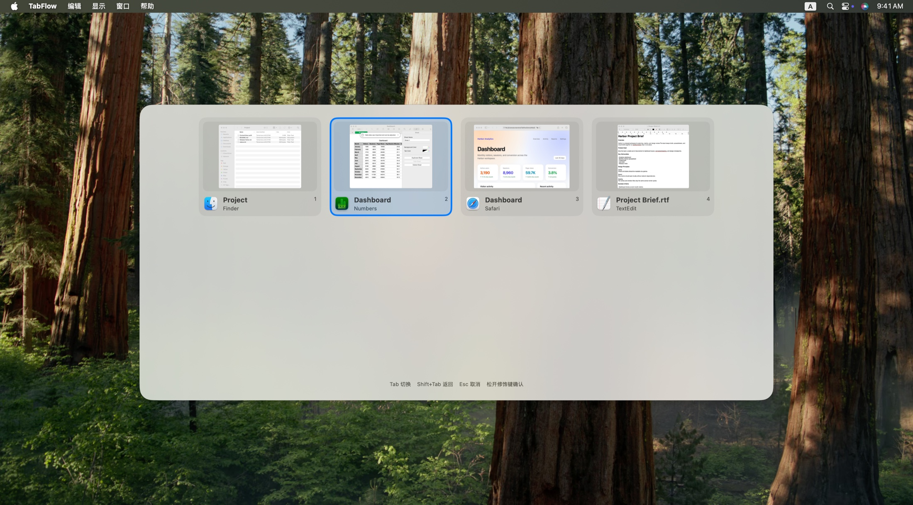
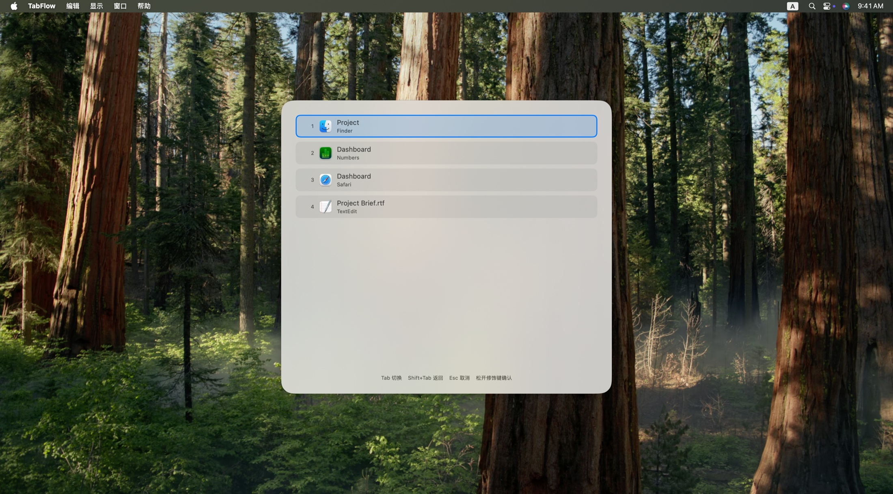
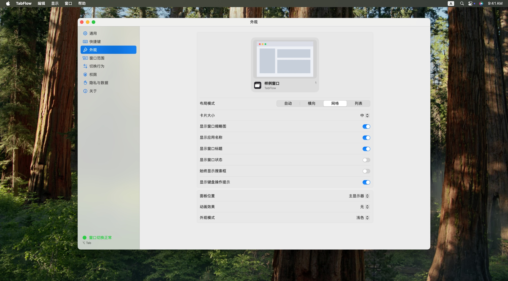

<p align="center">
  <a href="README.md">English</a> ·
  简体中文
</p>

<h1 align="center">TabFlow</h1>

<p align="center">
  切换窗口，而不只是应用。
</p>

<p align="center">
  <a href="https://github.com/Dreace/TabFlow/releases/latest"></a>
  
  
  <a href="LICENSE"></a>
</p>

<p align="center">
  
</p>

macOS 的 Command-Tab 按应用切换。一个应用开了多个窗口时，仍要再找一次目标窗口。

TabFlow 按窗口切换。按下 **⌥ Tab**，选中窗口，松开 ⌥ 即可切过去。

## 安装

从 [Releases](https://github.com/Dreace/TabFlow/releases/latest) 下载最新 DMG，打开后将 **TabFlow** 拖入“应用程序”。

首次运行时，按照提示授予所需权限。

## 功能

* 按窗口切换，支持同一应用的多个窗口
* 默认快捷键 **⌥ Tab**，可自定义
* 支持最小化窗口、多显示器和桌面空间
* 可选窗口缩略图
* 自动、横向、网格和列表布局
* 自定义窗口范围、排序和分组
* 常驻菜单栏，可登录时启动

## 预览

### 列表布局

<p align="center">
  
</p>

### 外观设置

<p align="center">
  
</p>

## 使用

按住 **⌥** 并按 **Tab** 打开切换器。继续按 Tab 选择窗口，松开 ⌥ 完成切换。

| 按键 | 作用 |
| --- | --- |
| ⌥ Tab | 打开切换器 / 下一个窗口 |
| ⇧⌥ Tab | 上一个窗口 |
| ← → ↑ ↓ | 移动选择 |
| Return | 立即切换 |
| Esc | 取消 |

快捷键可以在 **设置 → 快捷键** 中修改。

## 权限

TabFlow 使用以下系统权限：

| 权限 | 必需 | 用途 |
| --- | --- | --- |
| 辅助功能 | 是 | 获取窗口信息、恢复最小化窗口并切换窗口 |
| 输入监控 | 是 | 响应全局快捷键 |
| 屏幕录制 | 否 | 显示窗口缩略图 |

窗口信息和缩略图只在本机处理。

## 系统要求

* macOS 15.7 或更高版本

## Build

克隆仓库：

```bash
git clone https://github.com/Dreace/TabFlow.git
cd TabFlow
```

使用 Xcode 打开项目并运行：

```bash
open TabFlow.xcodeproj
```

也可以使用命令行构建：

```bash
xcodebuild \
  -project TabFlow.xcodeproj \
  -scheme tabflow \
  -configuration Debug \
  build
```

首次运行开发版本时，macOS 仍会要求授予辅助功能、输入监控等权限。

## 常见问题

### 可以切换浏览器标签页吗？

不能。TabFlow 切换的是 macOS 窗口，不是浏览器标签页。

### 支持多显示器吗？

支持。TabFlow 可以切换不同显示器上的窗口。

### 为什么没有窗口缩略图？

缩略图需要屏幕录制权限。没有这项权限时，仍可以通过应用图标和窗口标题进行切换。

### TabFlow 会替代 Mission Control 或窗口平铺工具吗？

不会。TabFlow 只负责切换已有窗口，不调整窗口大小或布局。

## License

TabFlow 使用 [GPL-3.0](LICENSE) 授权。
